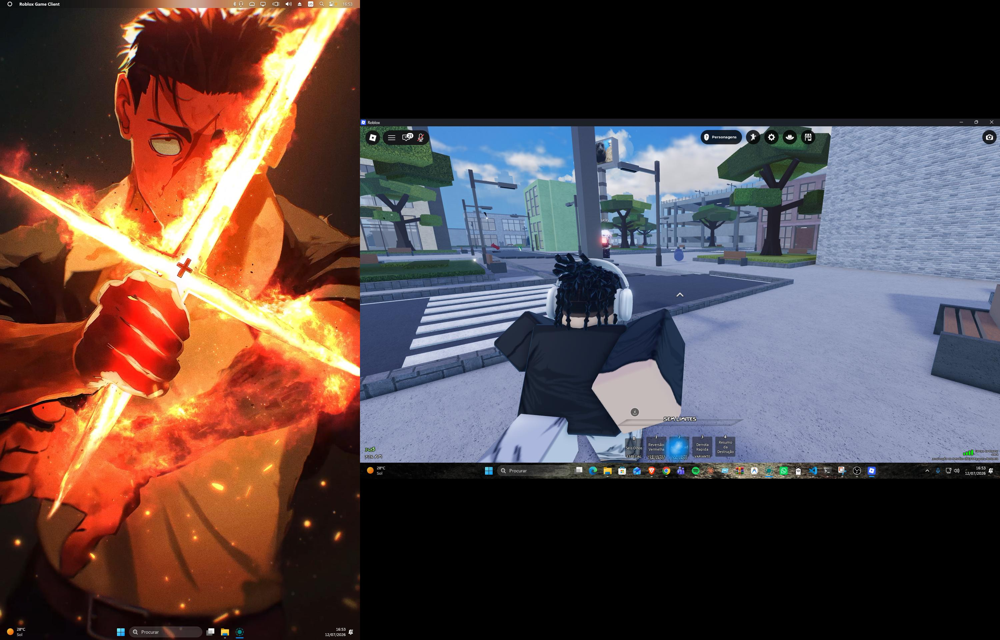

<div align="center">
  
  
  <h1>Cortex AI</h1>

  [](https://git.io/typing-svg)

  <p align="center">
    <a href="https://github.com/LORD998/Cortex-AI/stargazers"></a>
    <a href="https://github.com/LORD998/Cortex-AI/network/members"></a>
    <a href="https://github.com/LORD998/Cortex-AI/blob/main/LICENSE"></a>
  </p>
</div>

---

## 🌟 Visão Geral
A **Cortex AI** é uma inteligência artificial nativa para Windows, desenhada com foco na elegância e rapidez. Integrando-se invisivelmente no teu ambiente de trabalho, ela é invocada apenas quando precisas, assumindo a forma de uma esfera holográfica vibrante e reativa (estilo Siri).

<div align="center">
  
</div>

---

## ✨ Funcionalidades Core

| Funcionalidade | Descrição |
| --- | --- |
| 🎙️ **Walkie-Talkie** | Comunicação instantânea de voz mantendo a tecla `ALT` pressionada. |
| 👩‍🏫 **Modo Especialista** | Capacidade de assumir personas (ex: Professora de Inglês, Conselheira). |
| 🔮 **UI Holográfica** | Interface PyQt6 transparente, renderizada a 60FPS com pulsações baseadas na voz. |
| 🧠 **Motor LLM Local** | Respostas processadas 100% offline via **Ollama** (Qwen3:8b), sem subscrições. |
| 👻 **Stealth Mode** | Otimizada para arrancar e viver em background sem atrapalhar o ecrã. |

---

## 🚀 Arquitetura & Instalação

O projeto foi organizado com foco em escalabilidade, contendo arquitetura modular para voz, visão e memória.

### 🛠️ Instalação Rápida:
```bash
# 1. Clonar o repositório
git clone https://github.com/LORD998/Cortex-AI.git
cd Cortex-AI

# 2. Instalar dependências Python
pip install -r requirements.txt

# 3. Arrancar o servidor local
ollama run qwen3:8b

# 4. Ligar a IA em modo furtivo
start_cortex_hidden.vbs
```

---

## 🎮 Como Usar
Deixa o processo correr no fundo. A qualquer momento no Windows:
1. Pressiona e segura a tecla **`ALT`**.
2. A esfera da Cortex aparecerá no ecrã.
3. Faz a tua pergunta ou pedido com a voz.
4. Solta a tecla e ouve a magia acontecer!

<div align="center">
  <br/>
  
  <br/>
  <b>Criado por um Engenheiro Focado no Futuro 🚀</b>
</div>
